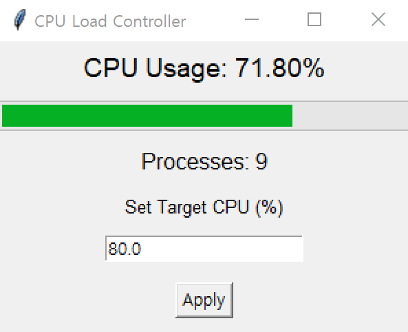

# CPU Load Controller

이 프로젝트는 Python과 Tkinter, `multiprocessing`을 사용하여 **CPU 사용률을 모니터링**하고,  
목표 CPU 사용률에 맞춰 **동적으로 CPU 부하를 생성·제어**하는 데모 애플리케이션입니다.  
GUI를 통해 실시간 CPU 사용량과 프로세스 개수를 확인하고, 목표 CPU 사용률을 설정할 수 있습니다.

---

## 주요 기능

1. **CPU 사용률 모니터링**  
   - `psutil`을 사용해 주기적으로 전체 CPU 사용률을 측정합니다.

2. **목표 CPU 사용률 동적 조절**  
   - 숫자 입력(또는 Entry)을 통해 목표 CPU 사용률 값을 지정하고,  
   - 현재 CPU 사용률과 비교해 **프로세스(쓰레드) 개수**를 자동으로 늘리거나 줄여서 부하를 조절합니다.

3. **GUI 인터페이스**  
   - Tkinter 기반의 윈도우 창에서 실시간 CPU 사용률(프로그레스바 + 숫자)을 보여주고,  
   - 프로세스(쓰레드) 개수도 확인할 수 있습니다.

4. **프로그램 종료 시 프로세스 정리**  
   - GUI를 닫으면 동적으로 생성되었던 모든 프로세스를 종료하고 프로그램이 완전히 종료됩니다.

---

## 스크린샷

{ width=200px }

## 설치 (Installation)
Python 3.8 이상 사용을 권장합니다.

1. **저장소를 클론 받거나 압축을 풀고, 해당 디렉토리로 이동합니다.**

```
git clone https://github.com/shiftkey1234/cpu_load_controller.git
cd cpu_load_controller
```

2. **필요 패키지 설치**

```
pip install psutil
tkinter는 일반적으로 기본 파이썬에 포함되어 있으나, 특정 OS(예: 일부 리눅스)에서는 추가 설치가 필요할 수 있습니다.
```

3. **실행 방법 (How to Run)**

프로젝트 폴더(예: cpu_load_controller) 안으로 이동

```
python cpu_load_controller.py
```
GUI가 표시되며 실시간 CPU 사용률과 프로세스 개수가 업데이트됩니다.
“Set Target CPU (%)” 부분에 원하는 목표 CPU 사용률을 입력하고 Apply 버튼을 누르면, 해당 사용률을 달성하려고 프로세스(쓰레드) 개수가 자동 조절됩니다.

4. **프로그램 종료**

창을 닫으면 모든 프로세스가 종료되어 프로그램이 완전히 종료됩니다.

## 빌드 (Build)
1. **PyInstaller를 이용한 단일 실행 파일(.exe) 생성**
2. **PyInstaller 설치**
```
pip install pyinstaller
```

3. **패키지 생성**
```
pyinstaller --onefile --windowed cpu_load_controller.py
--onefile: 모든 의존성을 단일 실행 파일(.exe)로 묶음
--windowed 또는 --noconsole: 콘솔 창 없이 GUI만 표시
```

4. **실행**

빌드가 끝나면 dist/ 폴더에 cpu_load_controller.exe 파일이 생성됩니다.
실행하면 GUI가 표시됩니다(Windows 기준).

## 라이선스 (License)
이 프로젝트는 MIT License를 따릅니다. 자세한 내용은 LICENSE 파일을 참고하세요.
